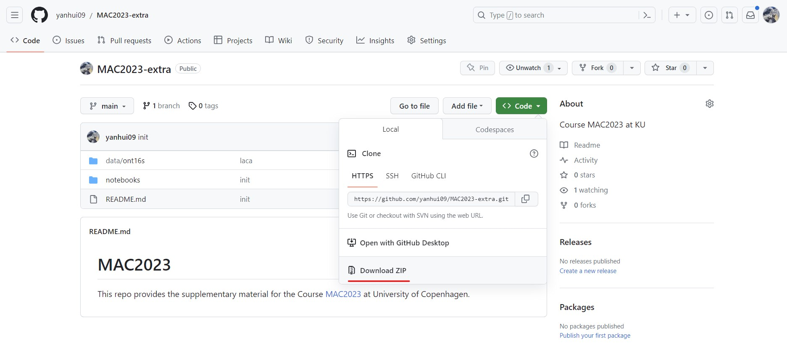

1. TOC
{:toc}

---

This section provides the requisites for the exercises, as well as some optional tools to accelerate your analysis.

## Requirements

### Conda & Mamba

[Conda](https://docs.conda.io/en/latest/) is a package manager that allows you to install, run, and update packages and their dependencies. It is a very useful tool to manage your analysis environment. 

[Mamba](https://github.com/mamba-org/mamba) is a reimplementation of the conda package manager in C++. It is much faster than conda, and is recommended for large-scale analysis.

To speed up the analysis, `mamba` is introduced here as a fast alternative for `conda`.

Assuming you have installed `conda` in previous sessions, here we only introduce how to install `mamba`.
If you still want to use `conda`, you can replace `mamba` with `conda` in the following commands.

To install `mamba`, please refer to the [official document](https://mamba.readthedocs.io/en/latest/mamba-installation.html#mamba-install).

Here we recommend *fresh install* rather *conda install*.
It's easy to install with [Mambaforge distribution](https://github.com/conda-forge/miniforge#mambaforge).
Find the right distribution for your system, download and install it.

For X86_64 Linux, you can use the following command to install `mamba`:

```
wget https://github.com/conda-forge/miniforge/releases/latest/download/Mambaforge-Linux-x86_64.sh
bash Mambaforge-Linux-x86_64.sh
```

### Docker

[Docker](https://www.docker.com/) is a set of platform as a service (PaaS) products that use OS-level virtualization to deliver software in packages called containers. Containers are isolated from one another and bundle their own software, libraries and configuration files; they can communicate with each other through well-defined channels. 

You can consider it as a virtual machine, but it is much faster and lighter than virtual machine.

To install `docker`, please refer to the [official document](https://docs.docker.com/get-docker/).

{: .imaportant }
> Due to the software dependencies (e.g., `singularity`, `seqkit`), [`LACA`](https://github.com/yanhui09/laca) and [`NART`](https://github.com/yanhui09/nart) are built and tested on [`linux/amd64`](https://en.wikipedia.org/wiki/X86-64) only.
> If you are using other systems, please use `docker` to run the pipelines.

### Exercise data

Excerise data can be access at [https://github.com/yanhui09/MAC2023-extra](https://github.com/yanhui09/MAC2023-extra).


## Optional reading

### Git

[Git](https://git-scm.com/) is a free and open source distributed version control system designed to handle everything from small to very large projects with speed and efficiency. It is very useful to manage your code and analysis.

Here we mainly use `git clone` to download the exercise data.
```
git clone --depth 1 https://github.com/yanhui09/MAC2023-extra.git
```

### Snakemake
[Snakemake](https://snakemake.readthedocs.io/en/stable/) is a workflow management system that aims to reduce the complexity of creating workflows by providing a fast and comfortable execution environment, together with a clean and modern specification language in python style.

[LACA](https://github.com/yanhui09/laca) and [NART](https://github.com/yanhui09/nart) are two pipelines based on `snakemake`. If you are familiar with [snakemake](https://snakemake.readthedocs.io/en/stable/), you will have a better understanding of the phylosophy behind these pipelines.
  
You can read more about `snakemake` in the [official document](https://snakemake.readthedocs.io/en/stable/).