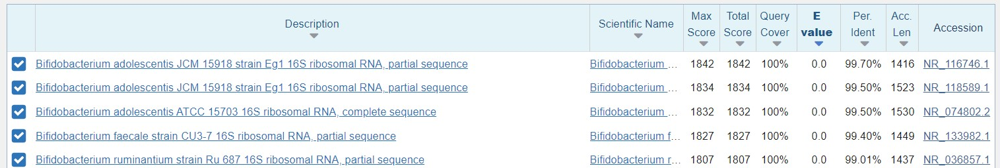

1. TOC
{:toc}

---
## *De novo* OTU picking from long amplicons with **LACA** 

[`LACA`](https://github.com/yanhui09/laca) is a reproducible and scalable workflow for Long Amplicon Consensus Analysis, e.g., 16S rRNA gene amplicon analysis. It uses `snakemake` to manage the workflow and `conda` to manage the environment.

## **LACA** installation

The full installation guide of `LACA` is available [here](https://github.com/yanhui09/laca).

You can choose to install `LACA` with `docker` image (which is only solution for `MacOS` users) or from the `GitHub` repository according to your `OS` and preference.

### Docker image

The easiest way to use `LACA` is to pull the `docker` image from [Docker Hub](https://hub.docker.com/r/yanhui09/laca) for cross-platform support.
```
docker pull yanhui09/laca
```

{: .important }
> `LACA` is built for `linux/amd64` platform, with cross-platform support through `docker`. 
> `MacOS` users needs to use docker container to run `LACA`.

### Installation from GitHub repository

**1.** Clone the Github repository and create an isolated `conda` environment
```
git clone https://github.com/yanhui09/laca.git
cd laca
mamba env create -n laca -f env.yaml 
```

**2.** Install `LACA` with `pip`
      
To avoid inconsistency, we suggest installing `LACA` in the above `conda` environment
```
conda activate laca
pip install --editable .
```

## A demo run with **LACA**

Find a full usage guide [here](https://github.com/yanhui09/laca#usage).

### Example with a quick start
```
laca init -b /path/to/basecalled_fastqs -d /path/to/database    # init config file and check
laca run all                                         # start analysis
```

### Get familiar with `LACA` usage

`LACA` is easy to use. You can start a new analysis in two steps using `laca init` and `laca run` . 

Remember to activate the conda environment if `LACA` is installed in a `conda` environment.
```
conda activate laca
laca -h
```

**To use the docker image**, you need to mount your data directory, e.g., `pwd`, to the  `/home` in the container.
```
docker run -it -v `pwd`:/home --privileged yanhui09/laca
laca -h
```

**1.** Intialize a config file with `laca init`

`laca init` will generate a config file in the working directory, which contains the necessary parameters to run `LACA`.

```
laca init -h
```

**2.** Start analysis with `laca run`

`laca run` will trigger the full workflow or a specfic module under defined resource accordingly.
Get a dry-run overview with `-n`. `Snakemake` arguments can be appened to `laca run` as well.

```
laca run -h
```

### Run `LACA` with a demo dataset

**0.** Make sure you have downlowded the required demo dataset from [here](https://github.com/yanhui09/MAC2023-extra). And the enter the directory with `cd`. 

E.g., Enter a directory with an absolute path ("long path") is `/home/me/MAC2023-extra`.
```
cd /home/me/MAC2023-extra
```

If you haven't downloaded the data yet and with `Git` installed,

```
git clone https://github.com/yanhui09/MAC2023-extra.git
cd ./MAC2023-extra 
```

**1.** Check where you are and try `laca init`, check the genereated `config.yaml` file.
```
pwd
laca init -b ./data/ont16s -d ./database -w ./laca_output --fqs-min 50
cat ./laca_output/config.yaml
```

**2.** Start `LACA` in a dry and real run
```
laca run all -w ./laca_output -n 
laca run kmerCon -j 4 -w ./laca_output      
```

`LACA` is able to generate `otu table`, `taxonomy table` and `phylogenetic tree` if you run the full workflow with `laca run all`. But it takes time to prepare the database and installation for the first use. 

As an example, here we only run the `kmerCon` module to extract consensus sequences based on kmer frequency.

Take a look at these consensus sequences, take the first one for [BLAST](https://blast.ncbi.nlm.nih.gov/Blast.cgi) search against `rRNA/ITS` database.
```
head -n2 ./laca_output/kmerCon/kmerCon.fasta
```

Expected output:
```
>pooled_0b000_0cand1
CACAATGGGCGCAAGCCTGATGCAGCGACGCCGCGTGCGGGATGACGGCCTTCGGGTTGTAAACCGCTTTTGACTGGGAGCAAGCCCTTCGGGGTGAGTGTACCTTTCGAATAAGCACCGGCTAACTACGTGCCAGCAGCCGCGGTAATACGTAGGGTGCAAGCGTTATCCGGAATTATTGGGCGTAAAGGGCTCGTAGGCGGTTCGTCGCGTCCGGTGTGAAAGTCCATCGCTTAACGGTGGATCCGCGCCGGGTACGGGCGGGCTTGAGTGCGGTAGGGGAGACTGGAATTCCCGGTGTAACGGTGGAATGTGTAGATATCGGGAAGAACACCAATGGCGAAGGCAGGTCTCTGGGCCGTCACTGACGCTGAGGAGCGAAAGCGTGGGGAGCGAACAGGATTAGATACCCTGGTAGTCCACGCCGTAAACGGTGGATGCTGGATGTGGGGACCATTCCACGGTCTCCGTGTCGGAGCCAACGCGTTAAGCATCCCGCCTGGGGAGTACGGCCGCAAGGCTAAAACTCAAAGAAATTGACGGGGGCCCGCACAAGCGGCGGAGCATGCGGATTAATTCGATGCAACGCGAAGAACCTTACCTGGGCTTGACATGTTCCCGACAGCCGTAGAGATACGGCCTCCCTTCGGGGCGGGTTCACAGGTGGTGCATGGTCGTCGTCAGCTCGTGTCGTGAGATGTTGGGTTAAGTCCCGCAACGAGCGCAACCCTCGCCCTGTGTTGCCAGCACGTCGTGGTGGGAACTCACGGGGGACCGCCGGGGTCAACTCGGAGGAAGGTGGGGATGACGTCAGATCATCATGCCCCTTACGTCCAGGGCTTCACGCATGCTACAATGGCCGGTACAACGGGATGCGACCTCGCGAGGGGGAGCGGATCCCTTAAAACCGGTCTCAGTTCGGATTGGAGTCTGCAACCCGACTCCATGAAGGCGGAGTCGCTAGTAATCGCGGATCAGCAACGCCGCGGTGAATGCGTTCCCGGGCC
```



The `BLAST` result indicates that this sequence is a `16S rRNA` gene fragment from `Bifidobacterium` with over 99% identity.

{: .important }
> Take one ONT read and do the same `BLAST` search. What do you expect to see?
>
> ```
> zcat ./data/ont16s/*.fastq.gz | head
> ```