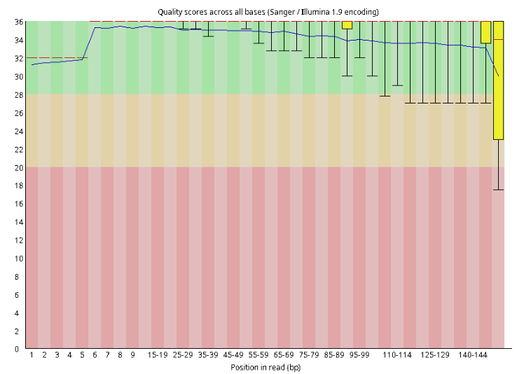
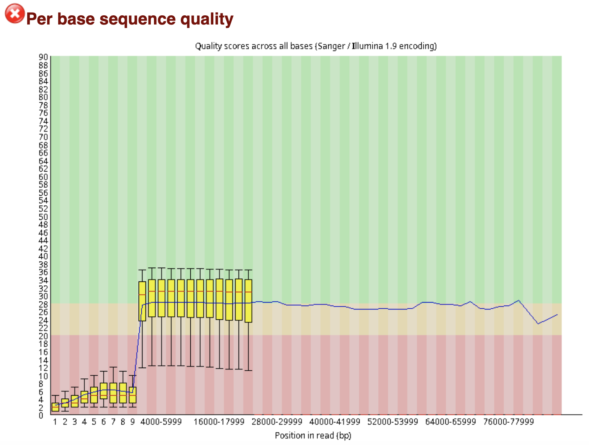
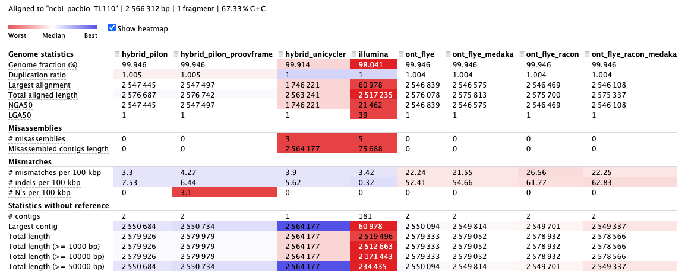
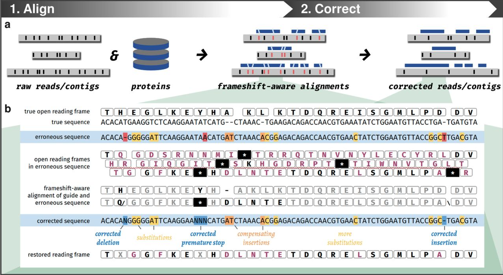

1. TOC
{:toc}

---
## Genome assembly with 2nd and 3rd WGS data

In this session, we aim to assemble a bacterial genome using 2nd and 3rd whole genome sequencing (WGS) data. 
We will use it this as example to explore the WGS data analysis, and look into the difference between sequencing technologies.

## Software installation with `mamba`

It's recommended to install the software with `mamba` in a **independent** conda environment.

Assuming you have installed `mamba` in your system, you can create a new conda environment with `mamba` and install the software with the following commands:

Go to the downloaded data directory. *Make sure you know where you are in the terminal.*

E.g., The downloaded data directory is placed at /home/username/MAC2023-extera.

```
cd /home/username/MAC2023-extera
pwd
```

You shall see the path of the downloaded data directory as below.
```
/home/username/MAC2023-extera
```

Now you can create a new conda environment with `mamba` and install the software with the following commands:

```
mamba env create -n wgs1 -f envs/env1.yaml
```

Activate the environment for the following analysis.

```
conda activate wgs1
```

## Exporation with a demo data

The WGS data can be fetched from [MAC2023-extra](https://github.com/yanhui09/MAC2023-extra) as before.
You shall download the data already if you have completed the previous exercises. In case you haven't, you can refer to the [requisites](https://yanhui09.github.io/MAC2023/exercieses/requisites) section.   

### First look at the data with `seqkit` and `fastqc`

```
seqkit stat data/wgs/*.fastq.gz data/wgs/ncbi_pacbio_TL110.fasta
```

Expected output:
```
file                              format  type  num_seqs     sum_len    min_len    avg_len    max_len
data/wgs/NXT20x_R1.fastq.gz       FASTQ   DNA    200,000  30,200,000        151        151        151
data/wgs/NXT20x_R2.fastq.gz       FASTQ   DNA    200,000  30,200,000        151        151        151
data/wgs/ont_r10_20x.fastq.gz     FASTQ   DNA      7,862  51,201,670        129    6,512.6     87,688
data/wgs/ncbi_pacbio_TL110.fasta  FASTA   DNA          1   2,566,312  2,566,312  2,566,312  2,566,312
```

Here is a set of sequencing data from a *Propionibacterium freudenreichii* strain. 
We subsampled the sequencing data to 20x coverage for the Illumina and Oxford Nanopore Technologies(ONT) reads. 
The PacBio reference genome is from the [NCBI RefSeq database](https://www.ncbi.nlm.nih.gov/nuccore/NZ_CP085641.1). 

{: .important }
>*Q1: What is the genome size of this strain? How is the sequencing coverage calculated?*
>
>illumina: 30,200,000*2/2,566,312≈20  
>
>ONT: 51,201,670/2,566,312≈20

Let's have a look at the quality of the sequencing data with `fastqc`.

```
mkdir -p fastqc/illumina fastqc/ont_r10
fastqc data/wgs/NXT20x_R*.fastq.gz -o ./fastqc/illumina
fastqc data/wgs/ont_r10_20x.fastq.gz -o ./fastqc/ont_r10
```

You can open the `.html` files in the `fastqc` directory to have a look at the quality of the sequencing data.

**Illumina**


**ONT**


{: .important }
>We could see the ONT read is way longer but contains more errors than the Illumina one. 


### Genome assembly with Illumina reads

#### Adapter removal with `trimmomatic`

`trimmomatic` is a tool for trimming adapters and low quality reads. [[Read more]](http://www.usadellab.org/cms/?page=trimmomatic)
 
The illumina reads are collected from the [NextSeq](https://emea.illumina.com/systems/sequencing-platforms/nextseq.html) platform, using the [Nextera](https://emea.illumina.com/products/by-type/sequencing-kits/library-prep-kits/nextera-xt-dna.html) library preparation kit.

```
mkdir illumina
trimmomatic PE -threads 4 -phred33 data/wgs/NXT20x_R1.fastq.gz data/wgs/NXT20x_R2.fastq.gz illumina/NXT20x_R1_paired.fastq.gz illumina/NXT20x_R1_unpaired.fastq.gz illumina/NXT20x_R2_paired.fastq.gz illumina/NXT20x_R2_unpaired.fastq.gz ILLUMINACLIP:data/wgs/NexteraPE-PE.fa:2:30:10 LEADING:3 TRAILING:3 MINLEN:50
```

Expected output in `MD5` validation:
```
eebcb480e669a92aff310cdecc71afec  illumina/NXT20x_R1_paired.fastq.gz
03ede64399251a7d2734a61c587b68ec  illumina/NXT20x_R1_unpaired.fastq.gz
47dc62c9846c7bda0d4f420c64f7a766  illumina/NXT20x_R2_paired.fastq.gz
36331358edf37d870eb69b329819a85c  illumina/NXT20x_R2_unpaired.fastq.gz
```

{: .important }
> `MD5` validation is a way to check if the file is downloaded correctly. [[Read more]](https://en.wikipedia.org/wiki/MD5) 
>
> You can use `md5sum` to check the `MD5` in Linux or `md5` in Mac.

#### Reads quality control with `bbmap`

`bbmap` is a set of tools for quality control of sequencing reads. It can be used to remove the duplicated reads and reads from the PhiX control. [[Read more]](https://jgi.doe.gov/data-and-tools/software-tools/bbtools/bb-tools-user-guide/bbmap-guide/)

`clumpify.sh` is a tool for removing duplicated reads. [[Read more]](https://jgi.doe.gov/data-and-tools/software-tools/bbtools/bb-tools-user-guide/clumpify-guide/)

`bbduk.sh` is a tool for removing reads from contamination (E.g., host genome, the PhiX control). [[Read more]](https://jgi.doe.gov/data-and-tools/software-tools/bbtools/bb-tools-user-guide/bbduk-guide/)

```
#clumpify
clumpify.sh in=illumina/NXT20x_R1_paired.fastq.gz in2=illumina/NXT20x_R2_paired.fastq.gz out=illumina/NXT20x_R1_paired_dedup.fastq.gz out2=illumina/NXT20x_R2_paired_dedup.fastq.gz dedupe optical spany adjacent
# bbduk
bbduk.sh in=illumina/NXT20x_R1_paired_dedup.fastq.gz in2=illumina/NXT20x_R2_paired_dedup.fastq.gz out=illumina/NXT20x_R1_paired_dedup_deduk.fastq.gz out2=illumina/NXT20x_R2_paired_dedup_deduk.fastq.gz ref=data/wgs/phiX174.fasta k=31 hdist=1
```

Expected output in `MD5` validation:
```
b60aa914d39ac6881e548fb0feeacfe6  illumina/NXT20x_R1_paired_dedup.fastq.gz
f8173d1b4804312acb990ff7125d0b36  illumina/NXT20x_R1_paired_dedup_deduk.fastq.gz
a3e164e4b96954f7fb106fc6f99df37c  illumina/NXT20x_R2_paired_dedup.fastq.gz
440f45289eb0d2a8bf60749082ef9661  illumina/NXT20x_R2_paired_dedup_deduk.fastq.gz
```

#### Genome assembly with `spades`  

`spades` is a genome assembler for short reads. [[Read more]](https://github.com/ablab/spades)

```
spades.py --isolate -t 4 -1 illumina/NXT20x_R1_paired_dedup_deduk.fastq.gz -2 illumina/NXT20x_R2_paired_dedup_deduk.fastq.gz -o illumina/spades
```

Expected assembly file in `MD5` validation:
```
0e730fd7f4742f9bd170a03b0b063806  illumina/spades/contigs.fasta
```

{: .important }
> *Q2: We here assembled a bacterial genome from a isolate. What if we have a metagenomic sample?*
>
> We can use `--meta` option in `spades` to assemble a metagenomic sample. [[Read more]](https://github.com/ablab/spades#basic-options)

### Genome assembly with ONT reads

#### Optional: Adapter removal with `guppy` or `porechop`

`guppy` is a tool for basecalling and adapter trimming of ONT reads. 
`guppy` is not open-source, thus you need to register an ONT account for documentation and download. [[Read more]](https://id.customers.nanoporetech.com/app/nanoporetech-customers_myaccount_1/exk2kkmfwpBAaT3WI697/sso/saml?RelayState=https://community.nanoporetech.com/downloads)

`porechop` is a open source tool for adapter trimming of ONT reads. [[Read more]](https://github.com/rrwick/Porechop)

**By default, barcodes will be trimmed by `guppy` during the demultiplexing step.**
We will not repeat the barcode trimming on our data.

In case you want to trim the barcodes, you can use the following command for `guppy`.
```
guppy_barcoder -i data/wgs/ont_r10_20x.fastq.gz -s ont_r10/ont_r10_20x_barcoded.fastq.gz --barcode_kits EXP-NBD104 --trim_barcodes
```

And the following command for `porechop`.
```
porechop -i data/wgs/ont_r10_20x.fastq.gz -o ont_r10/ont_r10_20x_porechop.fastq.gz --threads 4
```

#### Reads quality control with `seqkit`

`seqkit` is a tool for manipulating sequencing data. [[Read more]](https://bioinf.shenwei.me/seqkit/)
Here we use `seqkit` to remove the short reads and reads with low quality.

```
mkdir ont_r10
seqkit seq -j 4 -Q 10 -m 2000 -i data/wgs/ont_r10_20x.fastq.gz -o ont_r10/ont_r10_20x_f.fastq.gz
```

Check ONT reads before and after quality control with `seqkit stat`.
```
seqkit stat data/wgs/ont_r10_20x.fastq.gz ont_r10/ont_r10_20x_f.fastq.gz
```

Expected output:
```
file                            format  type  num_seqs     sum_len  min_len  avg_len  max_len
data/wgs/ont_r10_20x.fastq.gz   FASTQ   DNA      7,862  51,201,670      129  6,512.6   87,688
ont_r10/ont_r10_20x_f.fastq.gz  FASTQ   DNA      6,561  48,742,515    2,001  7,429.1   87,688
```

#### Genome assembly with `flye`

`flye` is a long-read genome assembler, recommended by ONT. [[Read more]](https://github.com/fenderglass/Flye)

```
flye --nano-raw ont_r10/ont_r10_20x_f.fastq.gz --out-dir ont_r10/flye --threads 4
```

Expected assembly file in `MD5` validation:
```
697328b0bcacc3870c97d79fddde9127  ont_r10/flye/assembly.fasta
```

{: .important }
> *Q3: By default, `flye` is used to assembly genomes. What if we have a metagenomic sample?*
>
>  We can use `--meta` option in `flye` to assembly a metagenomic sample. [[Read more]](https://github.com/fenderglass/Flye/blob/flye/docs/USAGE.md#-quick-usage)


#### Genome polishing with `racon` and `medaka`

long-read genome assemblers usually produce a draft genome with high contiguity but low accuracy.
Extra polishing steps are needed to improve the accuracy of the draft genome.
But the best polishing stratefy and tools are still under debate.

`racon` is a graph-based consensus algorithm for polishing long-read genome assemblies. [[Read more]](https://github.com/isovic/racon).

`medaka` is a official ONT polishing tool based on neural network. [[Read more]](https://github.com/nanoporetech/medaka)

Recently, the ONT recommended directly polishing `flye` assembly with `medaka`. But combining `racon` and `medaka` is still a common practice.

**Here we only choose `medaka` for polishing in our example.**

Since `medaka` is based on neural network, choosing the appropriate model will affect the polishing result.
You can use `medaka tools list_models` to list all the available models.
For our example, the ONT reads are collected from the [R10.4.1 flowcell](https://store.nanoporetech.com/eu/flow-cell-r10-4-1.html), and the `hac` mode of `guppy` is used for basecalling. 

```
medaka tools list_models
medaka_consensus -i ont_r10/ont_r10_20x_f.fastq.gz -d ont_r10/flye/assembly.fasta -o ont_r10/medaka -t 4 -m r1041_e82_260bps_hac_v4.1.0
```

Expected assembly file in `MD5` validation:
```
590eaf8d89c66f5354075ec5dba281ab  ont_r10/medaka/consensus.fasta
```

Optional: polishing with `racon` and `medaka`
```
mkdir ont_r10/racon
minimap2 -t 4 -x map-ont ont_r10/flye/assembly.fasta ont_r10/ont_r10_20x_f.fastq.gz > ont_r10/racon/flye_assembly.paf
racon -t 4 ont_r10/ont_r10_20x_f.fastq.gz ont_r10/racon/flye_assembly.paf ont_r10/flye/assembly.fasta > ont_r10/racon/racon.fasta
medaka_consensus -i ont_r10/ont_r10_20x_f.fastq.gz -d ont_r10/racon/racon.fasta -o ont_r10/racon/medaka -t 4 -m r1041_e82_260bps_hac_v4.1.0
```

Expected assembly file in `MD5` validation:
```
06e0814ec2fa261d4caf19bbedebc759  ont_r10/racon/racon.fasta
8887ee7681b5b77d5d4e9527ae5dae74  ont_r10/racon/medaka/consensus.fasta
```

### Hybrid assembly with ONT and Illumina reads

Hybrid assembly is a common practice to combine the advantages of different sequencing technologies.
Here we choose two commonly adopted strategies for hybrid assembly:

1. Directly use the ONT assembly as the backbone and polish it with Illumina reads. `pilon`
2. Short-read-first hybrid assembly. `unicycler`

#### Illumina reads polishing with `pilon`

`pilon` is a tool for polishing genome assemblies with short reads. [[Read more]](https://github.com/broadinstitute/pilon)

```
mkdir -p hybrid/pilon
bwa index ont_r10/medaka/consensus.fasta
bwa mem -t 4 ont_r10/medaka/consensus.fasta illumina/NXT20x_R1_paired_dedup_deduk.fastq.gz illumina/NXT20x_R2_paired_dedup_deduk.fastq.gz | samtools sort -@ 4 -o hybrid/pilon/aligned.bam
samtools index hybrid/pilon/aligned.bam
pilon --genome ont_r10/medaka/consensus.fasta --frags hybrid/pilon/aligned.bam --output hybrid/pilon/pilon --threads 4
```

Expected assembly file in `MD5` validation:
```
98a3f4f99d28a5b927c056ba22441720  hybrid/pilon/pilon.fasta
```

#### Optional: hybrid assembly with `unicycler`

`unicycler` can conduct a short-read-first hybrid assembly. [[Read more]](https://github.com/rrwick/Unicycler)

```
unicycler -l ont_r10/ont_r10_20x_f.fastq.gz -1 illumina/NXT20x_R1_paired_dedup_deduk.fastq.gz -2 illumina/NXT20x_R2_paired_dedup_deduk.fastq.gz -o hybrid/unicycler --threads 4
```

Expected assembly file in `MD5` validation:
```
c8b03dac6c834c3fc296b0cf64dc7d27  hybrid/unicycler/assembly.fasta
```

### Quality assessment of assembled genomes with `quast`

We have generated many assemblies with different strategies.
Let's use a deeply sequenced PacBio assembly as the reference genome to assess the quality of the assemblies.
You can take the provided assemblies under `./data/wgs/assemblies` if you haven't finished all assembly steps.

```
seqkit stat data/wgs/assemblies/*.fasta data/wgs/ncbi_pacbio_TL110.fasta
```

Expected output:
```
file                                               format  type  num_seqs    sum_len    min_len      avg_len    max_len
data/wgs/assemblies/hybrid_pilon.fasta             FASTA   DNA          2  2,579,926     29,242    1,289,963  2,550,684
data/wgs/assemblies/hybrid_pilon_proovframe.fasta  FASTA   DNA          2  2,579,979     29,245  1,289,989.5  2,550,734
data/wgs/assemblies/hybrid_unicycler.fasta         FASTA   DNA          1  2,564,177  2,564,177    2,564,177  2,564,177
data/wgs/assemblies/illumina.fasta                 FASTA   DNA        217  2,527,918         78     11,649.4     60,978
data/wgs/assemblies/ont_flye.fasta                 FASTA   DNA          2  2,579,333     29,239  1,289,666.5  2,550,094
data/wgs/assemblies/ont_flye_medaka.fasta          FASTA   DNA          2  2,579,052     29,238    1,289,526  2,549,814
data/wgs/assemblies/ont_flye_racon.fasta           FASTA   DNA          2  2,578,932     29,231    1,289,466  2,549,701
data/wgs/assemblies/ont_flye_racon_medaka.fasta    FASTA   DNA          2  2,578,566     29,229    1,289,283  2,549,337
data/wgs/ncbi_pacbio_TL110.fasta                   FASTA   DNA          1  2,566,312  2,566,312    2,566,312  2,566,312
```

{: .important }
> Compared to the reference, the total length of the assemblies are similar. 
>
> But the number of sequences (`num_seqs`) and the maximal sequence length (`max_len`) vary a lot. 

Let's chcek the quality of the assemblies with `quast`.

```
quast data/wgs/assemblies/*.fasta -r data/wgs/ncbi_pacbio_TL110.fasta -o quast
```

You can open the `report.html` file in the `quast` directory to have a look at the quality of the assemblies.


{: .important }
> *Q4: Based on the example, which sequencing technology would you think works better in genome completeness and contiguity?*
>
> Check `Genome fraction` and `NGA50`
>
> *Q5: Based on the example, which assembly do you think is the best in accuracy?*
>
> Check `Misassemblies` and `Mismatches`
>
> *Q6: Based on the example, what is the dominant error type in the ONT assembly?*
>
> Check `mismatches` and `indels`. [[Read more]](https://genome.sph.umich.edu/wiki/Indel) 
>
> *Q7: What would you think is the best assembly strategy for this example?*

### Optional: Reference-guided correction with `proovframe`

High frequency of `indels` results in frameshifts in the coding sequences (CDSs) of the ONT assembly.
With reference-guided correction, we can correct the frameshifts in the CDSs of the ONT assembly.

To use the `proovframe` tool, we need to create another conda environment with `mamba` due to the dependency conflict.

```
conda deactivate
mamba env create -n wgs2 -f envs/env2.yaml
conda activate wgs2
```

#### Genome annotation with `prokka`

`prokka` is a commonly used tool for rapid annotation of bacterial genomes. [[Read more]](https://github.com/tseemann/prokka)

```
mkdir proovframe
conda activate wgs2
prokka --outdir proovframe/prokka --prefix pacbio --cpus 4 data/wgs/ncbi_pacbio_TL110.fasta
```

Expected output with `MD5` validation:
```
a267a24bbd28151c716092173a2e79a1  proovframe/prokka/pacbio.err
46d48fbdb6c704865b19cf35c795708a  proovframe/prokka/pacbio.faa
1ab513dcf76b46beeb46f42275e65604  proovframe/prokka/pacbio.ffn
bf6336922fd8bdffa074c8565e920678  proovframe/prokka/pacbio.fna
63109e3ae31af589c972685508598e5f  proovframe/prokka/pacbio.fsa
cec178cf845ecbe3e5e377270a7f5cd1  proovframe/prokka/pacbio.gbk
9ac09d4da29f6ce7b347c63d42fa6a95  proovframe/prokka/pacbio.gff
53220e50b2a203a3a6e803583fea542e  proovframe/prokka/pacbio.log
68ff41f56df62d2023d86ae6159396cc  proovframe/prokka/pacbio.sqn
1f6457787abd3853ea9b867caaebec1d  proovframe/prokka/pacbio.tbl
66b8b6210b88f6a78a9b958034af1372  proovframe/prokka/pacbio.tsv
7905c89035c6589718690b63d1bffeaf  proovframe/prokka/pacbio.txt
```

We have many output files from `prokka`. Here we only use the translated protein sequences (`./proovframe/prokka/pacbio.faa` file) for `proovframe`.


#### Frameshift correction with `proovframe`



`proovframe` is a tool for reference-guided correction of frameshifts in CDSs. [[Read more]](https://www.biorxiv.org/content/10.1101/2021.08.23.457338v1)

```
proovframe map -a proovframe/prokka/pacbio.faa -o proovframe/pilon.tsv hybrid/pilon/pilon.fasta
proovframe fix -o proovframe/pilon_corrected.fasta hybrid/pilon/pilon.fasta proovframe/pilon.tsv
```

Expected assembly file in `MD5` validation:
```
3d1a8a553caa5370e4ba592b088bc535  proovframe/pilon_corrected.fasta
```

{: .important }
> *Q8: In the previous `quast` report, there's an increase of `N's` in the `hybrid_pilon_proovframe.fasta` assembly. Do you think it's good or bad?*